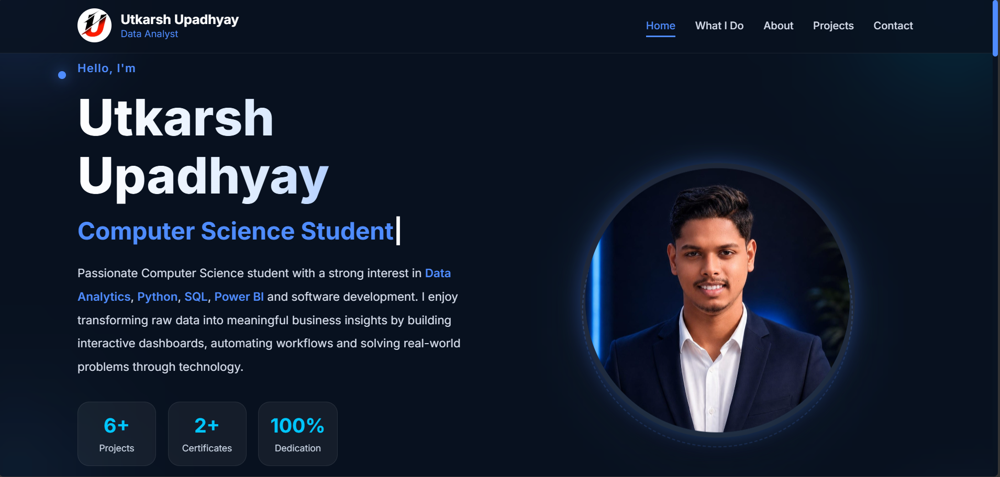

# 🌐 Personal Portfolio Website

> A portfolio that represents not only my skills but also my journey of learning, debugging, improving, and never giving up.

## 🚀 Live Demo

🔗 https://utkarsh123-mzp.github.io/portfolio-website/

---

## 📖 About the Project

This is my personal portfolio website built from scratch using **HTML, CSS, and JavaScript**.

The goal of this project was not just to create a portfolio but to strengthen my frontend development skills, understand Git & GitHub workflow, and deploy a real-world project successfully.

Every section, animation, layout, and feature was carefully built and improved through continuous learning and problem-solving.

---

## ✨ Features

- 🏠 Modern Home Section
- 👨‍💻 About Me
- 🛠️ Skills Section
- 📂 Projects Showcase
- 📄 Resume Download
- 📞 Contact Section
- 📱 Responsive Design
- ⚡ Smooth UI & Animations

---

## 🛠️ Technologies Used

- HTML5
- CSS3
- JavaScript (ES6)
- Git
- GitHub
- GitHub Pages

---

## 📂 Project Structure

```
portfolio-website/
│
├── assets/
├── scripts/
├── styles/
├── index.html
└── README.md
```

---

## 💻 Getting Started

Clone this repository

```bash
git clone https://github.com/utkarsh123-mzp/portfolio-website.git
```

Open the project folder

```bash
cd portfolio-website
```

Open `index.html` in your browser.

---

## 📸 Preview



---

## 🌱 What I Learned

This project helped me learn:

- Building a complete portfolio website
- Writing clean HTML, CSS & JavaScript
- Git version control
- GitHub repository management
- Git commits & pushes
- GitHub Pages deployment
- Debugging real-world issues
- Improving UI/UX through continuous iterations

---

## 🎯 Future Improvements

- Dark Mode
- More Interactive Animations
- Blog Section
- Project Filtering
- Contact Form Backend
- Performance Optimization

---

## 👤 Author

**Utkarsh Upadhyay**

- GitHub: https://github.com/utkarsh123-mzp
- Portfolio: https://utkarsh123-mzp.github.io/portfolio-website/

---

This portfolio is more than just a website.

It reflects patience, consistency, countless fixes, debugging sessions, and the belief that every problem has a solution if you keep learning.

